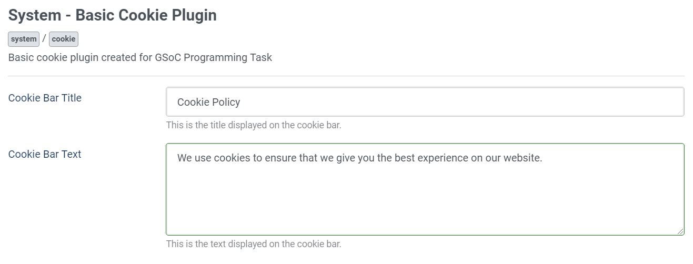
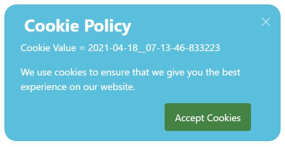

# Basic-Cookie-Plugin
Basic Cookie Plugin for GSoC Programming Task
<ol>
<li> It sets the cookie with value as date and time.
<li> Display the result in a pop-up with
</ol>

## Folder Structure

    ├── css
        └── cookie.css
    ├── js
        └── cookie.js
    ├── language
        └── en-GB
            └── en-GB.plg_system_cookie.ini
            └── en-GB.plg_system_cookie.sys.ini
    └── cookie.php
    └── cookie.xml

### Images

